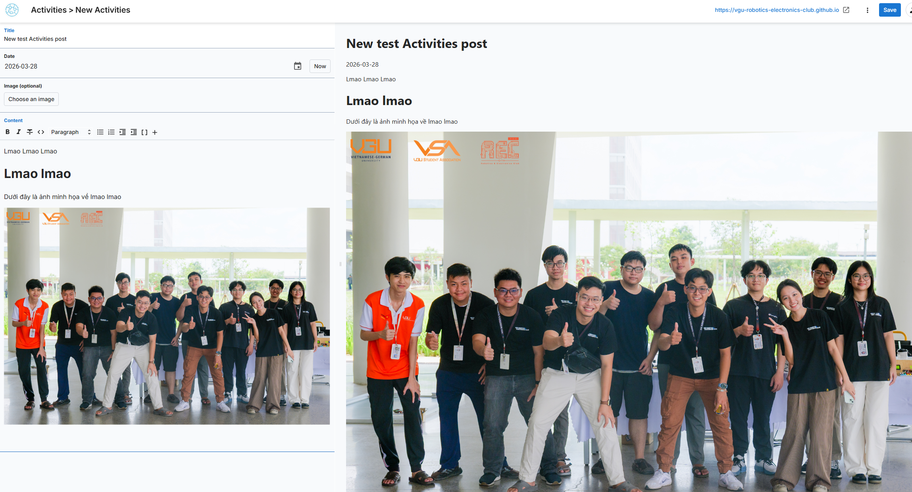
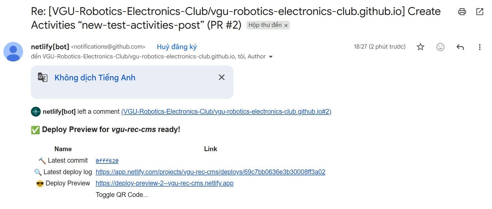
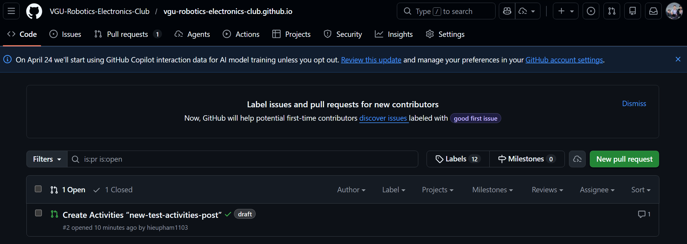
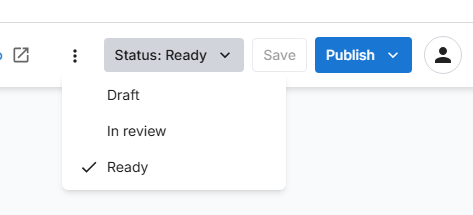

# Content Guide

This guide is for editors, content contributors, and non-technical members who need to add or update content without learning the whole codebase.

## Public reading

If you only want to read content, use the public site pages:

- Activities and workshops: `/activities/`
- Projects: `/projects/`
- Materials: `/materials/`
- Publications: `/publications/`
- Achievements: `/achievements/`
- Club info and members: `/about/`

Drafts are not public. Only published content appears on the website.

## Create a draft post

Use this flow when you want to create a new post in the CMS before it goes public.

1. Open `/admin/` in your browser.
2. Sign in with your Netlify Identity account.
3. Choose the collection that matches the content you want to create.
4. Click the new entry button for that collection.
5. Fill in the title first, then complete the rest of the fields.
6. Add the date so the post appears in the correct order on the site.
7. Upload a cover image if the collection uses one.
8. Write the main content in the editor area.
9. Check the preview if the CMS shows one.
10. Save the entry as a draft.

What to fill in for each content type:

The main collections are:

- Activities
- Workshops
- Projects
- Materials

Typical fields:

- Activities and workshops: title, date, image, content
- Projects: title, date, image, members, description, content
- Materials: title, course, date, description, publish, content

How the fields are used:

- Title becomes the page heading and the card title on listing pages.
- Date controls the order of recent content.
- Image appears on list cards and the top of the post page when the field is present.
- Members and description are shown on the Projects listing.
- Publish controls whether a Materials entry is visible on the public Materials page.




## Review and publish a post

The site uses editorial workflow, so a draft can be moved through review before it becomes public.

1. Save the content as a draft first.
2. Submit it for review when it is ready.
3. A reviewer can check the content in the CMS workflow queue.
4. Approve and publish the entry when it is final.

If you are not the reviewer, do not publish directly unless you are sure the content is final.

```
Important note for `Materials`:

- A `Materials` entry also has a `publish` checkbox.
- The public Materials page only shows entries where `publish: true`.
- If `publish` is false, the entry can still exist in the CMS, but it will stay hidden from the public list.
```

When save a draft version for a post, there will be an email or you can open the [Pull Requests](https://github.com/VGU-Robotics-Electronics-Club/vgu-robotics-electronics-club.github.io/pulls) page to open the preview website for that post.




You can publish the post or change the status for that post.



## How to update _data

Use the CMS `Data` section for structured records when possible. The editable files are:

- `_data/2024_members.yml`
- `_data/2025_members.yml`
- `_data/achievements.yml`
- `_data/publications.yml`

### Members

Each member entry uses fields like:

- `name`
- `image`
- `big_image`
- `role`
- `department`
- `description`

Notes:

- Images can be external URLs or local files in `assets/images/members/<year>/`.
- `board` and `member` are separate lists.
- Keep role and department names consistent, because the About page groups and colors entries based on those values.

### Achievements

Each achievement entry uses fields like:

- `title`
- `year`
- `category`
- `members`
- `team`
- `link`

The `members` field is a nested list. Each member can include:

- `name`
- `club_member`

### Publications

Each publication entry uses fields like:

- `title`
- `authors`
- `year`
- `venue`
- `link`
- `abstract`
- `tags`

The `authors` field is also nested. Each author can include:

- `name`
- `club_member`
- `roles`

## Safe editing rules

- Keep YAML indentation exact.
- Use double quotes for text when the content includes special characters or punctuation.
- Do not rename keys unless you also update the page templates that read them.
- After editing a data file, refresh the related public page to confirm the change appears correctly.

## When to ask for help

Ask a developer if you need to:

- Add a new collection type
- Change how a page groups or filters content
- Modify the CMS schema
- Change how images are resolved or displayed
